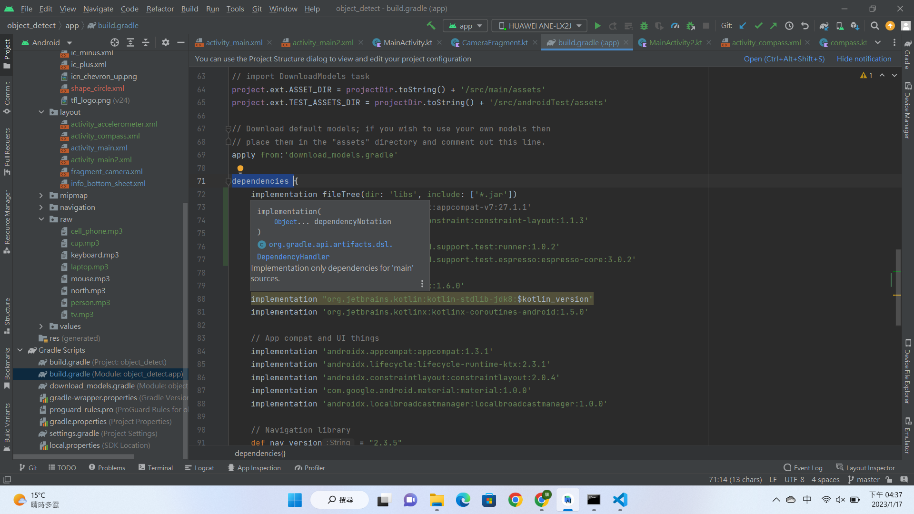

# TensorFlow Lite Object Detection Android  

### Android studio 安裝步驟
https://ithelp.ithome.com.tw/articles/10200176

### Object Detection介紹
https://www.tensorflow.org/lite/android/tutorials/object_detection

### github 下載連結
https://github.com/tensorflow/examples/tree/master/lite/examples

應該載完之後就可以到android studio 跑，如果有error可能是"dependencies"內的 implementation需要更新(試試看新版本或就版本)!!!

## android studio 教學

### Download
*  https://ithelp.ithome.com.tw/articles/10203680
*  https://ithelp.ithome.com.tw/users/20150372/ironman/5163

### Debugger
* https://www.youtube.com/watch?v=Hgtq3yXiOas&t=574s&ab_channel=JustimChung

### Logcat
* https://www.youtube.com/watch?v=OEnXX2OrvHY&ab_channel=JustimChung

---
## Kotlin 教學
* https://www.youtube.com/playlist?list=PLsEC4qT8YxBLvNJBs1a_hHd2iwSrHieKu
* https://ithelp.ithome.com.tw/users/20107700/ironman/1482
* https://ithelp.ithome.com.tw/users/20130189/ironman/3527
* https://ithelp.ithome.com.tw/users/20119398/ironman/2533

### Getter,Setter
* https://www.delftstack.com/zh-tw/howto/kotlin/kotlin-set/

###  Binding
* https://ithelp.ithome.com.tw/users/20120279/ironman/2417

### Fragment lifecycle
* https://ithelp.ithome.com.tw/articles/10286028

### Sensor & Vibration
* https://blog.csdn.net/Fybon/article/details/78275242
* https://stackoverflow.com/questions/47880450/how-to-vibrate-android-device-on-button-click-using-vibrator-effects-using-kotli

### Create Compass
* https://www.youtube.com/watch?v=th_ncOVh__o&ab_channel=IDStudio

### 其他連結在Code註釋中!

